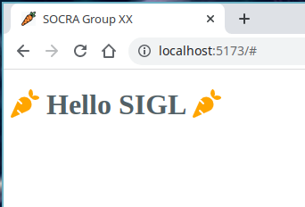

# React vite template

This is only aimed to be copied.

Copy the folder `frontend` to your local repository.

Then, just run your frontend locally from the `frontend/` folder like:

```sh
# Move to frontend directory
cd frontend/
# Use the correct version of Node
# should be the version inside frontend/.nvmrc file
nvm use
# install dependencies
npm install 
# run your frontend on localhost
npm run dev
```

You should be able to see your frontend running on [localhost:5173](http://localhost:5173)


